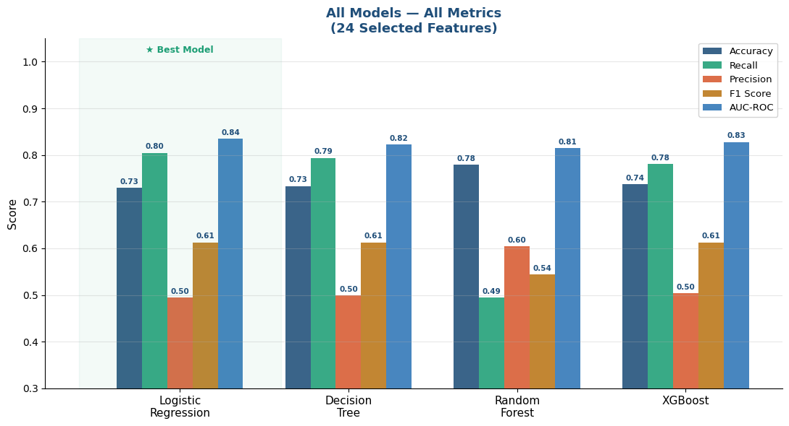
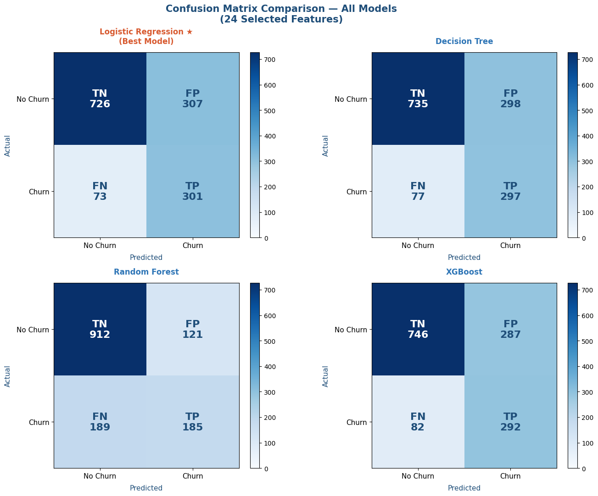

# Telco Customer Churn — Supervised ML Classification

[](YOUR_COLAB_LINK_HERE)
[](https://www.python.org/)
[](https://scikit-learn.org/)
[](LICENSE)

Predicting which telecom customers are likely to cancel their service, using the IBM Watson Telco dataset. Four classification models were trained and evaluated to identify the best predictor — enabling the business to intervene before losing customers.

---

## Table of contents

- [Problem statement](#problem-statement)
- [Dataset](#dataset)
- [Project structure](#project-structure)
- [Workflow](#workflow)
- [Results](#results)
- [Key findings](#key-findings)
- [Business recommendation](#business-recommendation)
- [How to run](#how-to-run)
- [Tools & libraries](#tools--libraries)

---

## Problem statement

Customer churn is one of the most costly problems in the telecom industry. Acquiring a new customer costs 5–7× more than retaining an existing one. This project builds a classification model that predicts which customers are at high risk of churning, so the business can proactively target them with retention offers before they leave.

**Target variable:** `Churn` — binary (Yes / No)  
**Type of problem:** Binary classification  
**Success metric:** AUC-ROC + F1 Score (chosen over accuracy due to class imbalance — only ~26% of customers churned)

---

## Dataset

| Property | Value |
|---|---|
| Source | [IBM Watson Telco Customer Churn — Kaggle](https://www.kaggle.com/datasets/blastchar/telco-customer-churn) |
| Records | 7,043 customers |
| Original features | 20 |
| Features after engineering | 24 (after encoding categorical variables) |
| Target | Churn (Yes/No) — 26.5% positive rate |

**Key features include:** contract type, tenure, monthly charges, internet service type, payment method, tech support, and online security subscription.

---

## Project structure

```
Telco-Customer-Churn-SupervisedML-Classification/
│
├── README.md                          ← You are here
├── Telco_Customer_Churn_...ipynb      ← Main notebook (EDA + modeling + SHAP)
├── requirements.txt                   ← Dependencies
└── images/                            ← Charts exported from notebook
    ├── churn_by_contract.png
    ├── roc_curves.png
    ├── confusion_matrix.png
    ├── shap_feature_importance.png
    ├── shap_summary_plot.png
    ├── shap_waterfall_highest_risk.png
    └── lr_coefficients.png
```

---

## Workflow

1. **Data loading & inspection** — shape, dtypes, missing values
2. **Data cleaning** — handled 11 missing values in `TotalCharges`, converted types
3. **Exploratory Data Analysis (EDA)** — churn rates by contract, tenure, services
4. **Feature engineering** — encoded categorical variables, scaled numerical features (24 final features)
5. **Model training** — 4 classifiers trained on 80/20 train-test split
6. **Model evaluation** — compared via AUC-ROC, F1 Score, Recall, Precision, and Accuracy
7. **Best model selection** — Logistic Regression chosen for highest AUC-ROC (0.835) and Recall (0.80)
8. **SHAP explainability** — feature importance, summary plot, waterfall chart for highest-risk customer

---

## Results

### Model comparison

| Model | AUC-ROC | Accuracy | Recall | Precision | F1 Score |
|---|---|---|---|---|---|
| **Logistic Regression** ⭐ | **0.835** | 0.73 | **0.80** | 0.50 | 0.61 |
| Decision Tree | 0.823 | 0.73 | 0.79 | 0.50 | 0.61 |
| XGBoost | 0.828 | 0.74 | 0.78 | 0.50 | 0.61 |
| Random Forest | 0.814 | 0.78 | 0.49 | 0.60 | 0.54 |


> **Winner: Logistic Regression** ⭐ — highest AUC-ROC (0.835) and highest Recall (0.80) across all 4 models. In a churn context, **Recall is the most important metric** — it measures how many actual churners we catch. Missing a churner (False Negative) is far more costly than a false alarm. LR correctly identified **301 out of 374 churners** (TP=301, FN=73), while also offering full interpretability — each coefficient explains exactly why a customer is flagged as at-risk.

**Confusion matrix — Logistic Regression (best model):**

| | Predicted: No Churn | Predicted: Churn |
|---|---|---|
| **Actual: No Churn** | TN = 726 | FP = 307 |
| **Actual: Churn** | FN = 73 | TP = 301 |

- **Caught 301 churners correctly** out of 374 actual churners (80% Recall)
- **Missed only 73 churners** — the lowest false negative count among all models
- Random Forest had the worst Recall (0.49) — missing nearly half of all churners despite higher accuracy

*Note: update the table above with your actual scores from the notebook.*

### Why Logistic Regression over XGBoost?

| Criteria | Logistic Regression | XGBoost |
|---|---|---|
| AUC-ROC | **0.835** (highest) | 0.828 |
| Recall | **0.80** (highest) | 0.78 |
| False Negatives | **73** (fewest missed churners) | 82 |
| Interpretability | High — coefficients per feature | Low — black box |
| Business usability | Retention teams can act on clear reasons | Hard to explain to stakeholders |
| Deployment simplicity | Very simple | More complex |

> Random Forest scored highest on Accuracy (0.78) and Precision (0.60) — but had the worst Recall (0.49), meaning it missed 189 actual churners. In churn prediction, a false negative (missing a churner) costs the business a full customer. Logistic Regression's 0.80 Recall means it catches 4 out of every 5 churners — the right trade-off for this problem.

---

## Key findings

Insights derived from SHAP (SHapley Additive exPlanations) analysis on the Logistic Regression model — providing feature-level explanations for every individual prediction, not just global averages.

**1. Tenure is the single most powerful predictor (SHAP = 1.08)**  
The longer a customer stays, the less likely they are to churn. Short-tenure customers (low feature value) consistently push the model toward a churn prediction (positive SHAP impact). This is confirmed by the SHAP summary plot — tenure has the widest spread of any feature, with low values (pink) driving churn and high values (blue) strongly preventing it.

**2. Having no internet service is actually a strong retention signal (SHAP = 0.54)**  
`InternetService_No` is the second most important feature. Customers without internet service churn far less — likely because they have simpler, lower-cost plans with fewer reasons to leave.

**3. Contract type is a critical lever — in both directions**  
- `Contract_One year` (SHAP = 0.43, negative coefficient) — the strongest protective factor. Annual contract customers are significantly less likely to churn.  
- `Contract_Two year` (SHAP = 0.38, negative coefficient) — even stronger retention.  
- `Contract_Month-to-month` (positive coefficient) — increases churn probability. Customers with no commitment are the highest-risk group.

**4. Fiber optic internet increases churn risk (SHAP = 0.39, positive coefficient)**  
Despite being the premium service tier, fiber optic customers churn more. Combined with no online security or tech support, this signals a "high price, low perceived value" problem — customers paying more but feeling underserved.

**5. No online security + no tech support = compounding risk**  
`OnlineSecurity_No` (SHAP = 0.22) and `TechSupport_No` (SHAP = 0.21) both increase churn probability. Customers without these add-ons feel exposed and unsupported — particularly those on fiber optic plans.

**6. Electronic check payment is a risk signal (SHAP = 0.17, positive coefficient)**  
Customers paying by electronic check churn at higher rates than those using automatic bank transfer or credit card. This may reflect lower commitment or financial instability.

**7. Highest-risk customer profile (Churn probability: 92.44%)**  
The model identified customer index 1149 as the highest-risk customer in the dataset. Their churn drivers:
- Very short tenure → SHAP +1.62 (strongest single driver)
- Fiber optic internet → SHAP +0.44
- Electronic check payment → SHAP +0.23
- No online security → SHAP +0.23
- Month-to-month contract → SHAP +0.22

This customer profile — new, fiber optic, no add-ons, paying by electronic check — is the archetypal at-risk customer this model is designed to catch.

---

## Business recommendation

Based on the Logistic Regression model and SHAP analysis, the following retention strategy is recommended. Because LR provides interpretable coefficients — and SHAP provides per-customer explanations — every recommendation below is directly traceable to a model output, not a gut feeling.

**Priority segment to target:**  
New customers (tenure < 12 months) + fiber optic internet + month-to-month contract + no online security or tech support + paying by electronic check. This is the highest-risk profile identified by the model, with predicted churn probabilities exceeding 90%.

**Recommended actions:**

- **Intervene early on tenure** — tenure is the #1 churn driver (SHAP = 1.08). The first 6 months are the highest-risk window. Trigger proactive outreach for all new customers in months 1–3: a welcome call, onboarding support, or a loyalty discount.

- **Incentivize contract upgrades** — `Contract_One year` has the strongest protective coefficient in the model. Offering month-to-month customers a first-year discount to switch to an annual plan directly addresses the top controllable churn driver.

- **Bundle security & support add-ons at onboarding** — `OnlineSecurity_No` and `TechSupport_No` both increase churn risk. For fiber optic customers especially, offer a 3-month free trial of these services at signup. Customers who feel protected churn significantly less.

- **Address the fiber optic value gap** — fiber optic customers churn despite paying premium prices. Consider a satisfaction survey or proactive tech support outreach for fiber optic customers in their first 90 days.

- **Target electronic check payers for payment migration** — offer a small billing credit (e.g. $5/month) to switch to automatic bank transfer. This reduces churn risk and payment failure rates simultaneously.

- **Deploy as a monthly early warning system** — score all active customers monthly using the LR model. Any customer with predicted churn probability > 60% should automatically enter a retention workflow. SHAP waterfall charts can generate a plain-language explanation for each flagged customer, making it actionable for non-technical retention teams.

> **Estimated impact:** The model catches 80% of actual churners (Recall = 0.80). Targeting the top 20% highest-risk customers identified by the model could prevent the majority of preventable churn in any given month, while keeping retention campaign costs manageable.

---

## How to run

### Option 1 — Run in Google Colab (recommended)

Click the badge at the top of this README → runs in your browser, no setup needed.

### Option 2 — Run locally

```bash
# Clone the repo
git clone https://github.com/JeanAndre376/Telco-Customer-Churn-SupervisedML-Classification.git
cd Telco-Customer-Churn-SupervisedML-Classification

# Install dependencies
pip install -r requirements.txt

# Open the notebook
jupyter notebook Telco_Customer_Churn_SupervisedML_Classification.ipynb
```

### requirements.txt

```
pandas
numpy
scikit-learn
xgboost
shap
matplotlib
seaborn
jupyter
```

---

## Tools & libraries

| Tool | Purpose |
|---|---|
| Python 3.10 | Core language |
| Pandas & NumPy | Data manipulation |
| Matplotlib & Seaborn | Visualizations |
| Scikit-learn | Logistic Regression, Decision Tree, Random Forest, XGBoost |
| SHAP | Model explainability — feature importance & per-customer predictions |
| Google Colab | Development environment |

---

## Author

**JeanAndre376**  
Aspiring Data Scientist — currently building a portfolio in ML & Analytics  
[GitHub Profile](https://github.com/JeanAndre376)

---

*Dataset credit: IBM Watson Sample Data — available on [Kaggle](https://www.kaggle.com/datasets/blastchar/telco-customer-churn)*
