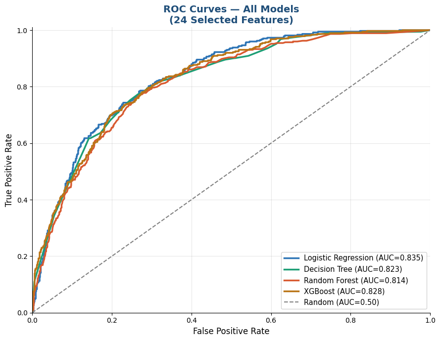
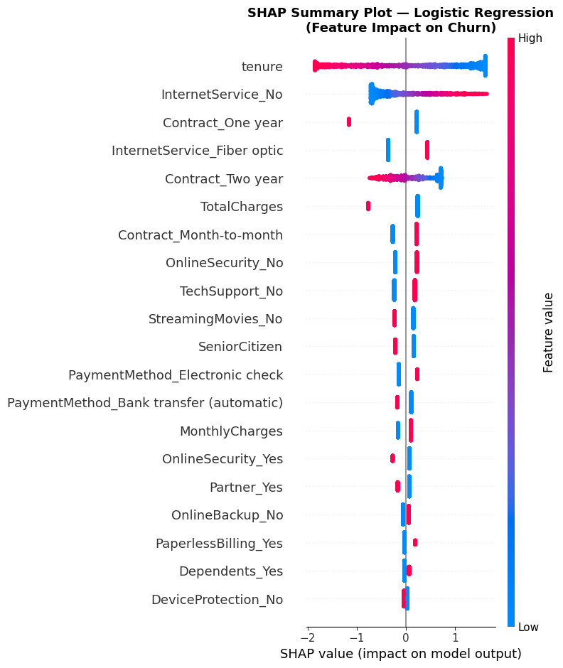
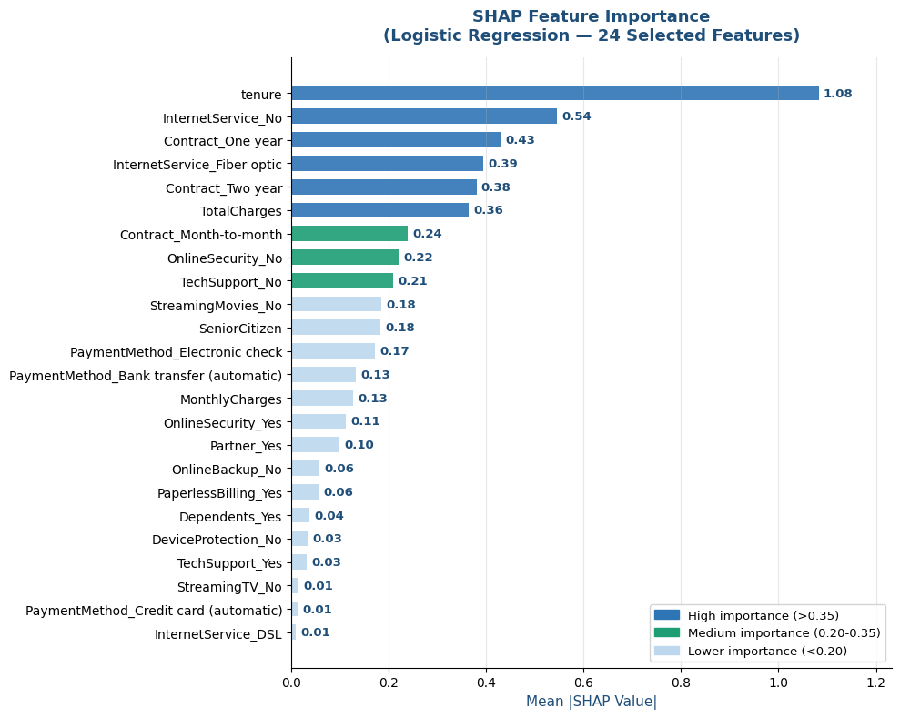
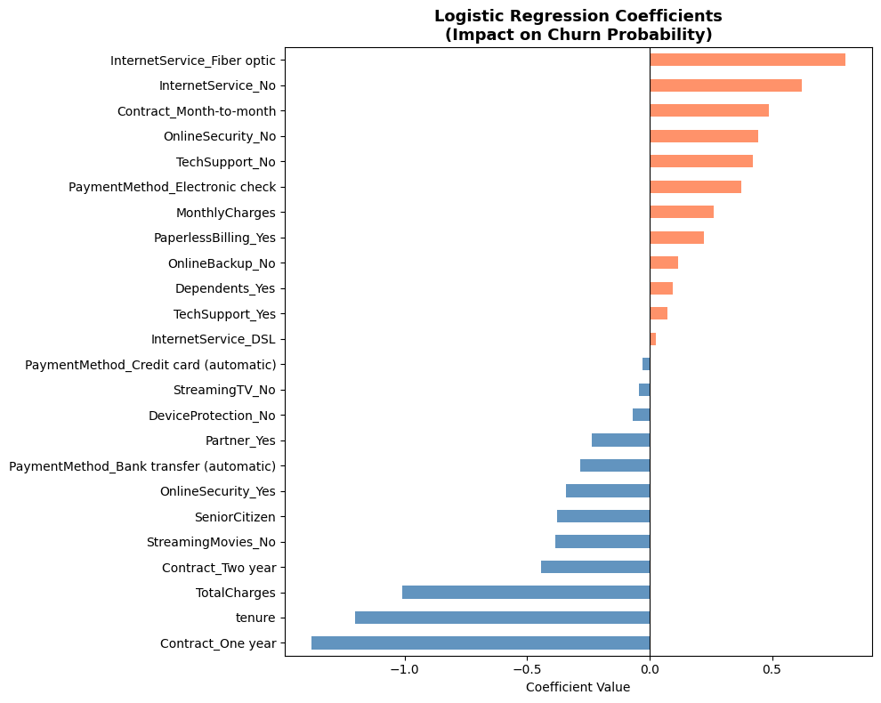
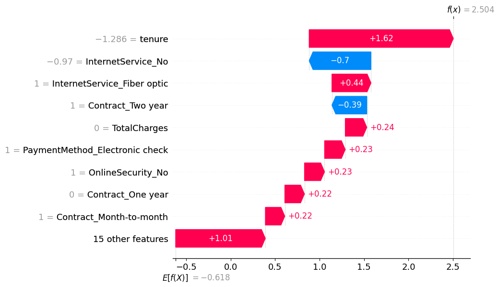

# Telco Customer Churn — Supervised ML Classification

[](YOUR_COLAB_LINK_HERE)
[](https://www.python.org/)
[](https://scikit-learn.org/)


Predicting which telecom customers are likely to cancel their service, using the IBM Watson Telco dataset. Four classification models were trained and evaluated to identify the best predictor — enabling the business to intervene before losing customers.

---

## Table of contents

- [Problem statement](#problem-statement)
- [Dataset](#dataset)
- [Project structure](#project-structure)
- [Workflow](#workflow)
- [Results](#results)
- [Key findings](#key-findings)
- [Business recommendation](#business-recommendation)
- [How to run](#how-to-run)
- [Tools & libraries](#tools--libraries)

---

## Problem statement

Customer churn is one of the most costly problems in the telecom industry. Acquiring a new customer costs 5–7× more than retaining an existing one. This project builds a classification model that predicts which customers are at high risk of churning, so the business can proactively target them with retention offers before they leave.

**Target variable:** `Churn` — binary (Yes / No)  
**Type of problem:** Binary classification  
**Success metric:** AUC-ROC + F1 Score (chosen over accuracy due to class imbalance — only ~26% of customers churned)

---

## Dataset

| Property | Value |
|---|---|
| Source | [IBM Watson Telco Customer Churn — Kaggle](https://www.kaggle.com/datasets/blastchar/telco-customer-churn) |
| Records | 7,043 customers |
| Original features | 20 |
| Features after engineering | 24 (after encoding categorical variables and removal of some irrelevant features (no correlation) |
| Target | Churn (Yes/No) — 26.5% positive rate |

**Key features include:** contract type, tenure, monthly charges, internet service type, payment method, tech support, and online security subscription.

---

## Project structure

```
Telco-Customer-Churn-SupervisedML-Classification/
│
├── README.md                          ← You are here
├── Telco_Customer_Churn_...ipynb      ← Main notebook (EDA + modeling + SHAP)
├── requirements.txt                   ← Dependencies
└── images/                            ← Charts exported from notebook
    ├── churn_by_contract.png
    ├── roc_curves.png
    ├── confusion_matrix.png
    ├── shap_feature_importance.png
    ├── shap_summary_plot.png
    ├── shap_waterfall_highest_risk.png
    └── lr_coefficients.png
```

---

## Workflow

1. **Data loading & inspection** — shape, dtypes, missing values
2. **Data cleaning** — handled 11 missing values in `TotalCharges`, converted types
3. **Exploratory Data Analysis (EDA)** — churn rates by contract, tenure, services
4. **Feature engineering** — encoded categorical variables, scaled numerical features (24 final features)
5. **Model training** — 4 classifiers trained on 80/20 train-test split
6. **Model evaluation** — compared via AUC-ROC, F1 Score, Recall, Precision, and Accuracy
7. **Best model selection** — Logistic Regression chosen for highest AUC-ROC (0.835) and Recall (0.80)
8. **SHAP explainability** — feature importance, summary plot, waterfall chart for highest-risk customer

---

## Results

### Model comparison

| Model | AUC-ROC | Accuracy | Recall | Precision | F1 Score |
|---|---|---|---|---|---|
| **Logistic Regression** ⭐ | **0.835** | 0.73 | **0.80** | 0.50 | 0.61 |
| Decision Tree | 0.823 | 0.73 | 0.79 | 0.50 | 0.61 |
| XGBoost | 0.828 | 0.74 | 0.78 | 0.50 | 0.61 |
| Random Forest | 0.814 | 0.78 | 0.49 | 0.60 | 0.54 |


> **Winner: Logistic Regression** ⭐ — highest AUC-ROC (0.835) and highest Recall (0.80) across all 4 models. In a churn context, **Recall is the most important metric** — it measures how many actual churners we catch. Missing a churner (False Negative) is far more costly than a false alarm. LR correctly identified **301 out of 374 churners** (TP=301, FN=73), while also offering full interpretability — each coefficient explains exactly why a customer is flagged as at-risk.

**Confusion matrix — Logistic Regression (best model):**


- **Caught 301 churners correctly** out of 374 actual churners (80% Recall)
- **Missed only 73 churners** — the lowest false negative count among all models
- Random Forest had the worst Recall (0.49) — missing nearly half of all churners despite higher accuracy

## ROC Curve Charts all models


### Why Logistic Regression over XGBoost?

| Criteria | Logistic Regression | XGBoost |
|---|---|---|
| AUC-ROC | **0.835** (highest) | 0.828 |
| Recall | **0.80** (highest) | 0.78 |
| False Negatives | **73** (fewest missed churners) | 82 |
| Interpretability | High — coefficients per feature | Low — black box |
| Business usability | Retention teams can act on clear reasons | Hard to explain to stakeholders |
| Deployment simplicity | Very simple | More complex |

> Random Forest scored highest on Accuracy (0.78) and Precision (0.60) — but had the worst Recall (0.49), meaning it missed 189 actual churners. In churn prediction, a false negative (missing a churner) costs the business a full customer. Logistic Regression's 0.80 Recall means it catches 4 out of every 5 churners — the right trade-off for this problem.

---

## Key findings and Insights

## SHAP Summary


## Feature Importance


## Coefficients



## High Risk Profile



**1. Tenure is the Dominant Predictor (SHAP = 1.08)**  

SHAP importance of 1.08 — almost twice the second feature. Short tenure customers (0-12 months) carry dramatically higher churn risk as confirmed by the beeswarm plot showing high-feature-value (red) dots clustering at SHAP values of -2 to -3, meaning long tenure customers have strong negative SHAP values (pushing strongly away from churn).
• Business implication: Focus all retention efforts on customers in the first 12 months. An early engagement programme (onboarding calls, service quality checks, loyalty offers) during the critical first year is the single most impactful intervention.

**2. Contract Type is the Strongest Categorical Driver**  

Month-to-month contract (coefficient +0.55) dramatically increases churn risk while one-year contract (coefficient -1.10) provides the strongest individual protection against churn. The Contract_One year coefficient of -1.10 is the largest magnitude coefficient in the entire model.

• Business implication: Incentivising customers to upgrade from month-to-month to annual contracts (discount, service bundle, device offer) is the most cost-effective retention strategy. Even a partial conversion of month-to-month customers to one-year contracts would significantly reduce overall churn

**3. Fiber Optic Customers are the Highest-Risk Service Segment**  

InternetService_Fiber optic achieves both the highest positive coefficient (+0.75) and the fourth highest SHAP importance (0.39). Fiber optic customers pay premium prices and have the most competitive alternatives — making them the most likely to switch providers.

• Business implication: Implement a dedicated fiber optic retention programme — proactive account management, competitive pricing review, and service quality monitoring specifically for fiber customers on month-to-month contracts (the highest-risk combination).

**4. Absence of Support Services Drives Churn**  
OnlineSecurity_No (coefficient +0.50, SHAP 0.21) and TechSupport_No (coefficient +0.45, SHAP 0.22) are significant churn drivers. Customers who lack security and support services feel underserved and are more likely to seek alternatives.

• Business implication: Bundle online security and tech support into service packages at onboarding — customers with these services show significantly lower churn rates. Consider offering these services at a discount or free trial to at-risk customers.

**7. High-Risk Customer Profile**  
SHAP analysis of the highest-risk customer (index: 1149, predicted churn probability 0.92+) reveals the typical high-risk profile: very short tenure (0-6 months), month-to-month contract, fiber optic internet service, no online security, electronic check payment method, and no tech support.

**7. Limitations and Future Work** 

Single snapshot data: Dataset represents one point in time — no temporal customer behaviour tracking
Impact: Cannot capture churn risk evolution over lifecycle; contract renewal spikes invisible

Missing behavioural features: No complaint history, support tickets, app usage, or network quality scores
Impact: Important churn drivers (dissatisfaction) absent; model relies on billing/contract proxies

Class imbalance (mild): 26.5% churn vs 73.5% no-churn requires class weighting 
Impact: Recall for churn class (80.48%) lower than no-churn (88%+); some churners still missed

Low precision: 49.09% precision means ~51% of churn alerts are false alarms
Impact: Retention budget partially wasted on loyal customers who were not at risk

**Most Significant Limitations**:

The most significant limitation is the low precision (49.09%) , meaning approximately 51% of customers flagged as churners are actually loyal customers who would not have left. This false alarm rate means that for every 2 retention offers sent, 1 goes to a customer who did not need it wasting retention budget. While recall (80.48%) is strong, the precision-recall trade-off remains the primary performance challenge.

The single-snapshot nature of the data is also limiting. Customer churn is a dynamic process — risk profiles change as charges increase, competitors enter the market, or service quality degrades. A longitudinal dataset with monthly snapshots per customer would enable sequence-based modelling that captures the trajectory of churn risk rather than its static value at one point in time.

**Future Improvements**

Temporal features: Add month-over-month KPI changes: charge increase trend, usage decline, support frequency.
ImpactCaptures early warning signals before churn decision;

Network quality integration: Link churn to network KPIs (call drop rate, data speed, NPS scores)
Impact: Bridges customer churn with technical root causes — directly actionable by RF engineers

Survival analysis: Replace binary with Cox Proportional Hazards model 
Impact: Predict not just IF customer churns but WHEN — enables time-targeted retention offers

Ensemble/stacking: Stack LR + DT + XGBoost using Ridge meta-learner on OOF predictions
Impact: Expected AUC-ROC improvement +1-2% through diversity of base model errors

**RF Engineering Extension**

From an RF Planning & Optimization perspective, the most impactful future extension is the integration of network quality KPIs as additional churn predictors. Network-related churn — where customers leave due to poor coverage, dropped calls, or slow data —is a controllable variable that RF engineers can directly address. Linking the churn prediction model to cell-level KPIs (RSRP, RSRQ, SINR, dropped call rate) by customer location would enable: network-triggered churn prevention (identifying customers in cells with degrading KPIs before they churn), root cause attribution via SHAP (showing that churn in a specific area is driven by interference rather than pricing), and coverage investment prioritisation (directing antenna optimisation resources to cells serving high-CLV, high-churn-risk customer clusters).


# Notebook
[](Telco_Customer_Churn_SupervisedML_Classification.ipynb)

## Connect
[](https://www.linkedin.com/in/jean-fred-a-williama-36905315/)


## Tools & libraries

| Tool | Purpose |
|---|---|
| Python 3.10 | Core language |
| Pandas & NumPy | Data manipulation |
| Matplotlib & Seaborn | Visualizations |
| Scikit-learn | Logistic Regression, Decision Tree, Random Forest, XGBoost |
| SHAP | Model explainability — feature importance & per-customer predictions |
| Google Colab | Development environment |

---

## Author

**JeanAndre376**  
Aspiring Data Scientist — currently building a portfolio in ML & Analytics  
[GitHub Profile](https://github.com/JeanAndre376)

---

*Dataset credit: IBM Watson Sample Data — available on [Kaggle](https://www.kaggle.com/datasets/blastchar/telco-customer-churn)*
